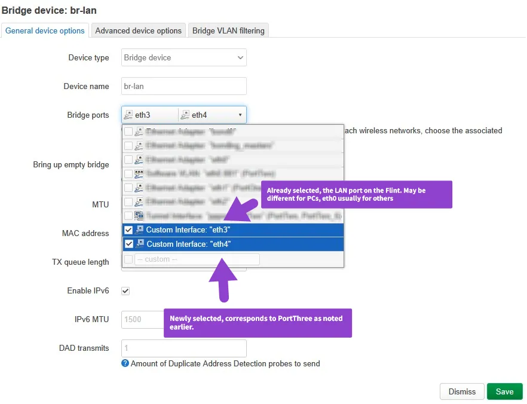

## Change a WAN port to LAN

Example using the Flint, changing `PortThree` to be used as LAN:

{: style="max-height:700px;border:6px solid #d2ccf1;"}

***

1. Visit *Network* -> *Interfaces* and click *Edit* next to `PortThree`
{: style="max-height:700px;border:6px solid #d2ccf1;"}
2. Select `unspecified` in *Device* field, note down the previous selection.
3. *Save and Apply* then head to *Devices* sub-tab.
4. Click *Configure* next to `br-lan` and check-box the interface name that you noted down in step 2. (`eth3` for the Flint) 
{: style="max-height:700px;border:6px solid #d2ccf1;"}
5. All done! Network interruption may occur.