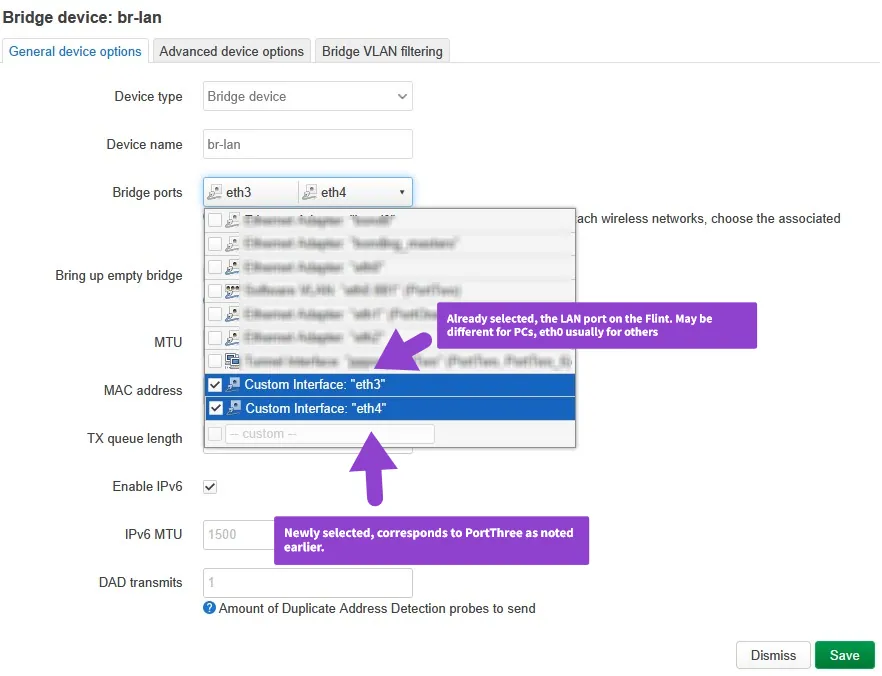

# Change a WAN Port to LAN

Example using the Flint, changing `PortThree` to be used as LAN:

{: style="max-height:700px;border:6px solid #d2ccf1;"}

---

## Steps to Change WAN to LAN

1. Navigate to **Network** -> **Interfaces** and click **Edit** next to `PortThree`.  
   {: style="max-height:700px;border:6px solid #d2ccf1;"}

2. In the **Device** field, select `unspecified` and note down the previous selection.

3. Click **Save and Apply**, then go to the **Devices** sub-tab.

4. Click **Configure** next to `br-lan` and check the box for the interface name you noted in step 2 (e.g., `eth3` for the Flint).  
   {: style="max-height:700px;border:6px solid #d2ccf1;"}

5. Note that a brief network interruption may occur during this process.