## Installation using a smartphone as an example for quick setup

### Download and Follow the Instructions
Download and follow the instructions from the [release](https://github.com/TalalMash/SmoothWAN/releases) page.

### Connect Your Wired Internet Connections (If Available)
Connect your wired internet connections (if available):  

{: style="max-height:700px;border:6px solid #d2ccf1;"}
{: style="max-height:700px;border:6px solid #d2ccf1;"}

### Connect Your Phone to Wi-Fi
The Slate or Flint is now broadcasting as a Wi-Fi access point for easy configuration, disable mobile data and connect your phone to Wi-Fi `SmoothWAN Setup 2.4 or 5Ghz` with password: `brassworld`.  
In your browser, visit: http://172.17.17.2, there is no password set  

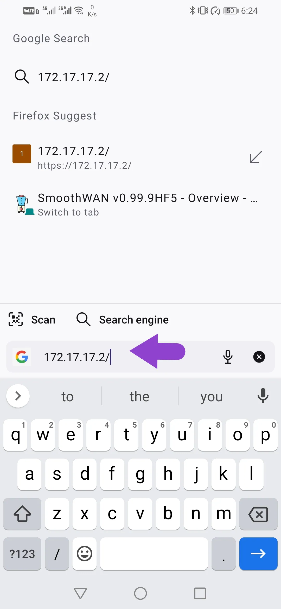{: style="max-height:700px;border:6px solid #d2ccf1;"}
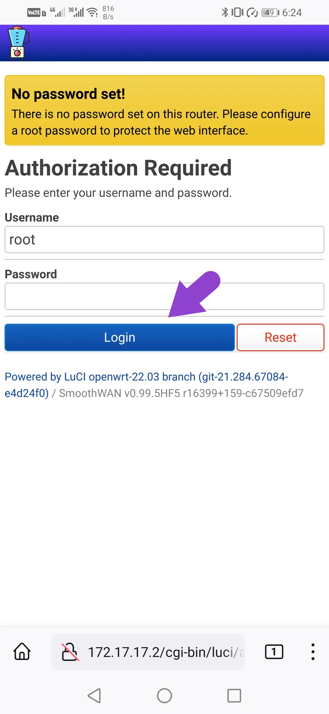{: style="max-height:700px;border:6px solid #d2ccf1;"}

### Wireless Internet Sources
Skip the following steps if all your internet sources to be used by Speedify are wired, else head to **`Simple Wi-Fi Setup`**

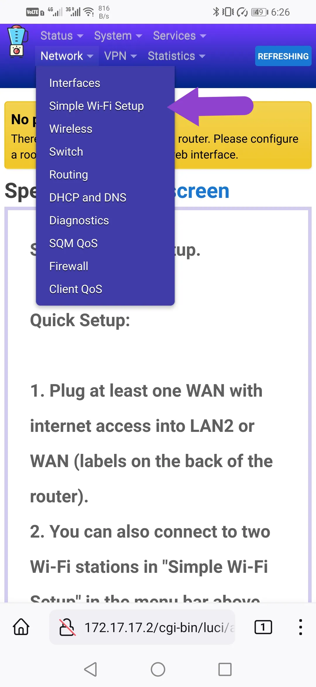{: style="max-height:700px;border:6px solid #d2ccf1;"}
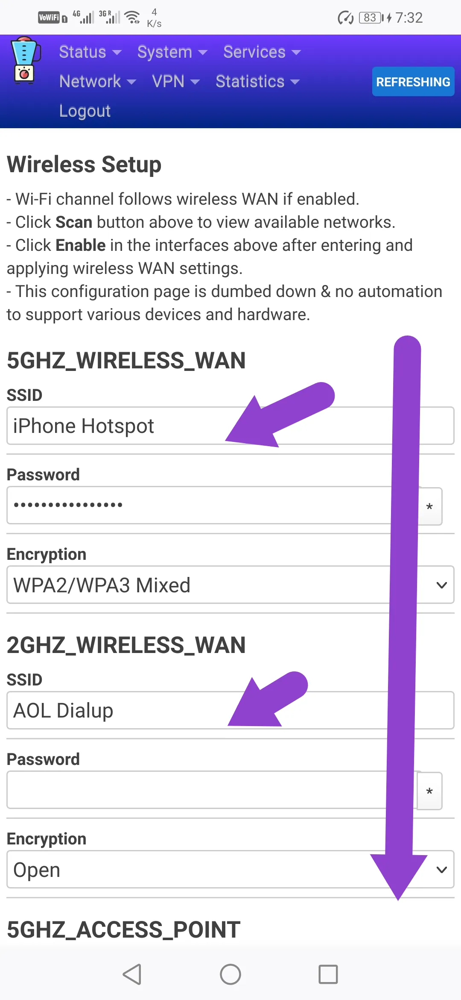{: style="max-height:700px;border:6px solid #d2ccf1;"}

### Change Access Point SSID/Password
You can change your access point SSID/Password as well

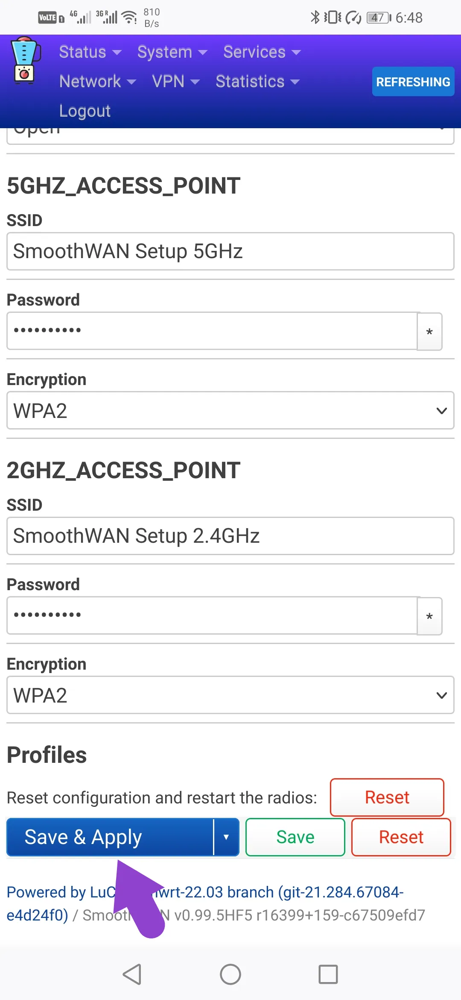{: style="max-height:700px;border:6px solid #d2ccf1;"}

### Enable Configured Wireless WANs
Enable the wireless WANs that you have configured

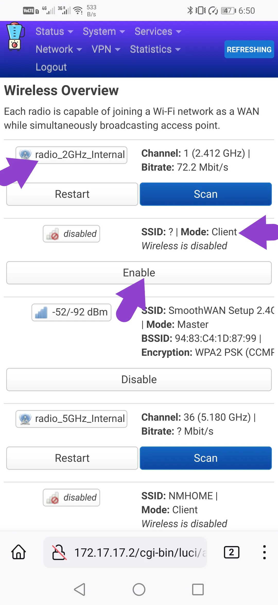{: style="max-height:700px;border:6px solid #d2ccf1;"}
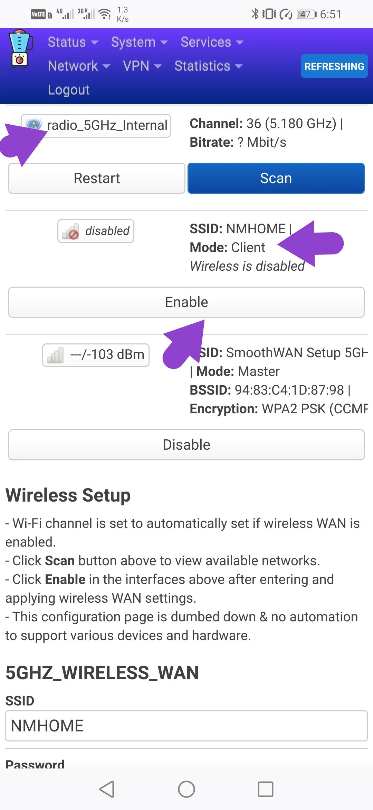{: style="max-height:700px;border:6px solid #d2ccf1;"}

### Install Speedify
With all your WANs now connected, install Speedify

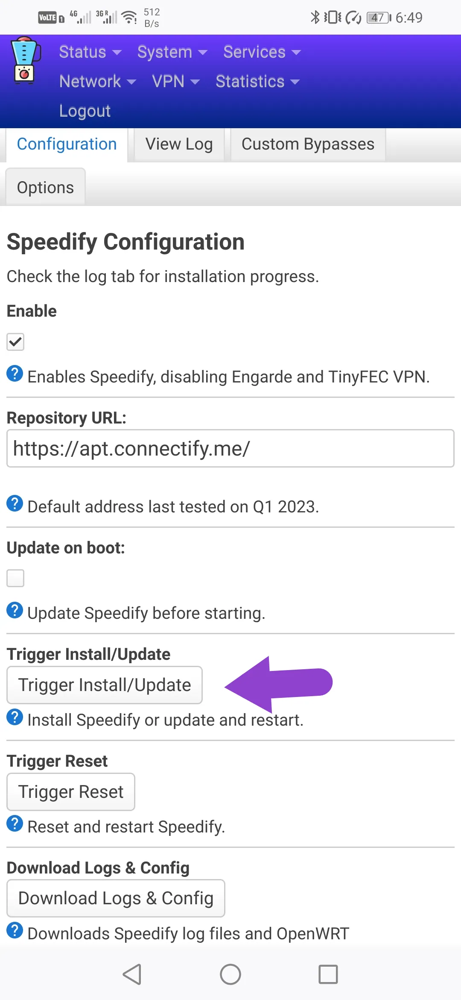{: style="max-height:700px;border:6px solid #d2ccf1;"}

### Login to Speedify
Head back to the home page **Status -> Overview**

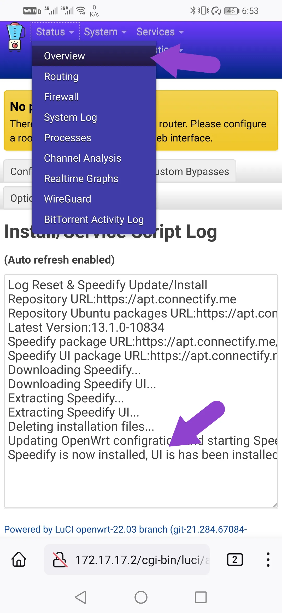{: style="max-height:700px;border:6px solid #d2ccf1;"}
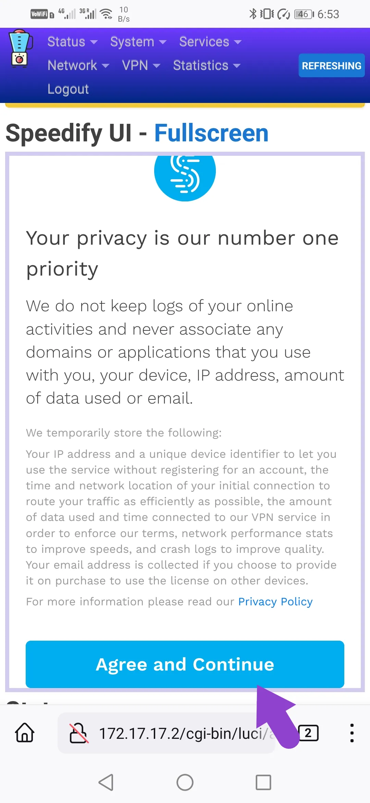{: style="max-height:700px;border:6px solid #d2ccf1;"}

### Change Web Login Password
You can change your web login password in the administration page  

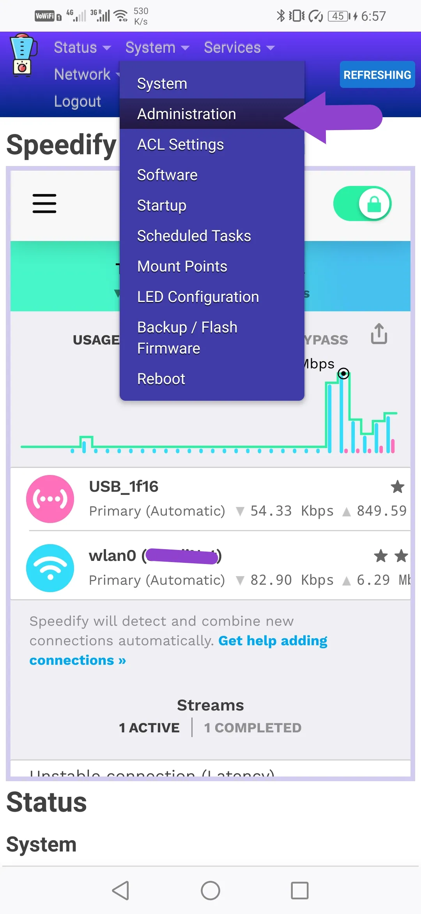{: style="max-height:700px;border:6px solid #d2ccf1;"}

***