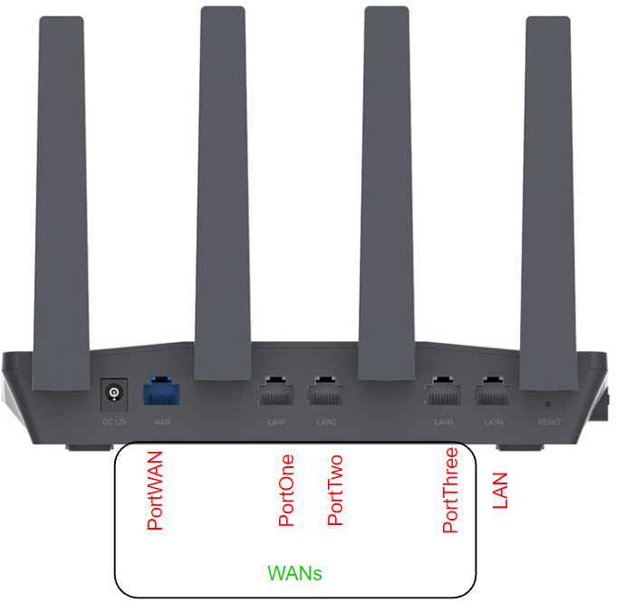

<b>As of Q4 2024, Speedify now requires a [license for routers](https://speedify.com/store/#routers).</b>
<h2>Installation using a smartphone as an example for quick setup</h2>

- Download and follow the instructions from the [release](https://github.com/TalalMash/SmoothWAN/releases) page.  
- Connect your wired internet connections (if available):  

{: style="max-height:700px;border:6px solid #d2ccf1;"}
{: style="max-height:700px;border:6px solid #d2ccf1;"}

- The Slate or Flint is now broadcasting as a Wi-Fi access point for easy configuration, disable mobile data and connect your phone to Wi-Fi `SmoothWAN Setup 2.4 or 5Ghz` with password: `brassworld`.  
- In your browser, visit: http://172.17.17.2 there is no password set:  

{: style="max-height:700px;border:6px solid #d2ccf1;"}
{: style="max-height:700px;border:6px solid #d2ccf1;"}

- Skip the following steps if all your internet sources to be used by Speedify are wired, else head to `Simple Wi-Fi Setup`: 

{: style="max-height:700px;border:6px solid #d2ccf1;"}
{: style="max-height:700px;border:6px solid #d2ccf1;"}

**You can change your access point SSID/Password as well**

{: style="max-height:700px;border:6px solid #d2ccf1;"}

**Enable the wireless WANs that you have configured**

{: style="max-height:700px;border:6px solid #d2ccf1;"}
{: style="max-height:700px;border:6px solid #d2ccf1;"}

**With all your WANs now connected, install Speedify:**

{: style="max-height:700px;border:6px solid #d2ccf1;"}
{: style="max-height:700px;border:6px solid #d2ccf1;"}
{: style="max-height:700px;border:6px solid #d2ccf1;"}

**All done!**

You can change your web login password in the administration page.
{: style="max-height:700px;border:6px solid #d2ccf1;"}

***
**Notes**

- Some USB devices are problematic with SmoothWAN built-in USB network adapter renamer (the unique name shown in the example as `USB_1f16`), you can disable this option in Speedify navigation menu -> Options. The adapter naming will be named by the order of first detection e.g `usb0`, `usb1` which can be random on every power up. 
For data limited users, Speedify won't be able to tell which USB connected adapter corresponds to the set data limits and statistcs.

{: style="max-height:700px;border:6px solid #d2ccf1;"}
