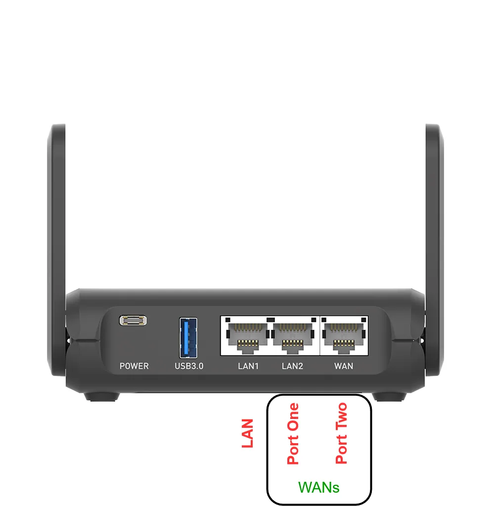

## Port Layout

Credits to **sqlazer** for sending one for testing and support.  


---

## Troubleshooting

### Adding Second Wired WAN Drops the Other Wired WAN

Make sure that you have installed the Slate AX image. The Flint image works with the wrong port configuration (they're the same hardware).

---

### Slate AX Wi-Fi Scan Results Empty (Only in version 0.99.8)

Disable existing AP/configurations (click the Disable buttons) before scanning.  
This issue was fixed in version 0.99.x.

---

### 802.11k/v/s/r Support

For versions below 0.99.9, GL.iNet’s `wpad` is stripped. Force an update from the OpenWrt official server after installation and reboot:

```
opkg update && opkg remove wpad-openssl && opkg install wpad-openssl --force-overwrite
```
