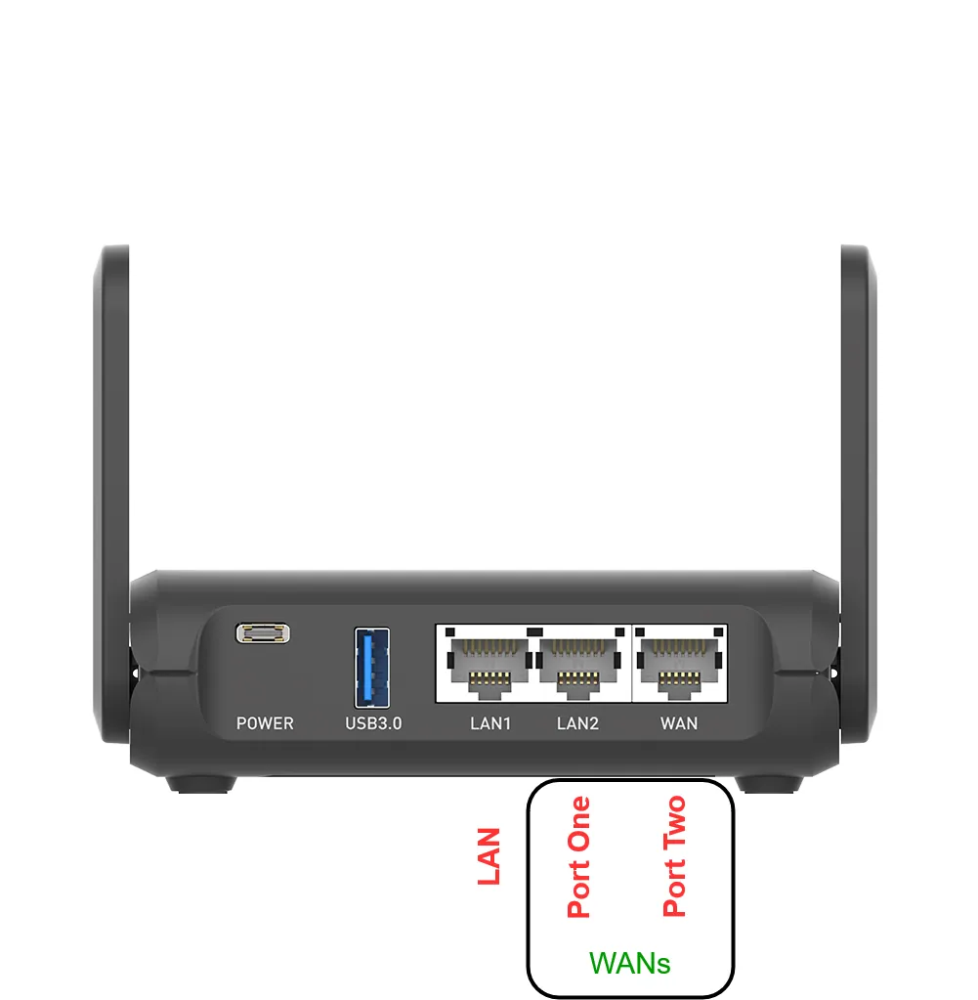

### Port Layout
Credits to **sqlazer** for sending one for testing and support

### Troubleshooting

## Adding second wired WAN drops the other wired WAN
Make sure that you have installed the Slate AX image, the Flint image works with the wrong port configuration (they're the same hardware).

## Slate AX Wi-Fi scan results empty (Only in version 0.99.8)
Disable existing AP/configurations (click Disable buttons) before scanning.  
This issue was fixed in version 0.99.x

## 802.11k/v/s/r Support
For versions below 0.99.9 GL.iNet `wpad` is stripped, force update from OpenWrt official server after installation and reboot:  
`opkg update && opkg remove wpad-openssl && opkg install wpad-openssl --force-overwrite`
