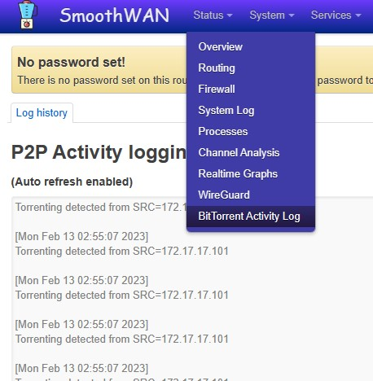

### Using the Raspberry Pi as a tethering device

Connect the Type-C port on the Pi to your PC/Camera, it will automatically tether the internet over Speedify.

For 0.99.9HF5 and below Windows requires an [additional driver](https://github.com/dukelec/mb/raw/master/doc/win_driver/mod-duo-rndis.zip).

### Identifying client using P2P or BitTorrent

{: style="max-height:700px;border:6px solid #d2ccf1;"}

### Issues with Wi-Fi 2.4Ghz clients (Wireless WAN)

Check for connected USB 3.0+ devices as it's a [common issue with 2.4Ghz Wi-Fi](https://en.wikipedia.org/wiki/USB_3.0#Issues)

## Bridging a Wi-Fi SSID to an ethernet port

Create a new bridge, and move the port from LAN/WAN to the new bridge, then select the bridge in Interfaces -> Wireless -> Edit -> Network.

### Quick VLAN setup

Assuming ISP modem is plugged at trunk #1 on the managed switch:  
*Network* -> *Interfaces* -> *Devices* -> *Add device configuration* 

(change _Device Name_ for a more friendly name to appear in Speedify UI) 

{: style="max-height:700px;border:6px solid #d2ccf1;"}

*Network* -> *Interfaces* -> *Add new interface*   

{: style="max-height:700px;border:6px solid #d2ccf1;"}  

Set Firewall zone to RED, and gateway metric to `200` or more.

### Reduceing bufferbloat for gaming
* Set one WAN as "Primary", preferably the landline or the lowest latency, others as "Secondary".    
* Set transport mode to UDP, and rate limit each to 70% of max speed.  
* Optionally set mode to redundant.
* Engarde may perform better than Speedify in this case but will use significantly more bandwidth.

*Ping (ICMP) is not a good measure, in "Streaming mode" detected flows are optimized and use a different path (redundant - low buffer). Use in-game latency indicators.*   
*Speedify UDP mode seems to require powerful hardware to control bufferbloat to a minimum (~10%), use an Intel/AMD router.*

### Hide interface or WAN from Speedify

Rename interface to start with "br-"

### Check downloaded image integrity
You can use [in-browser tools](https://emn178.github.io/online-tools/sha256_checksum.html) to check the file for errors, the calculated sum is in `sha256.*` file in the Releases section. 
OpenWrt upgrade UI may also show you the sha256 checksum calculated after being received.
