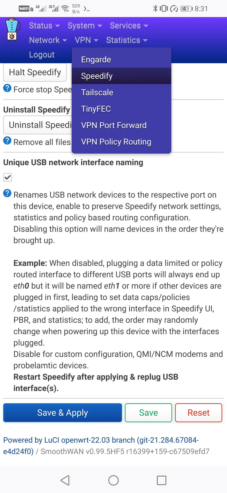
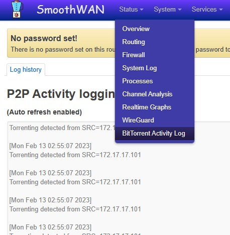

### USB network device random name on restart

Some USB devices may experience issues with SmoothWAN's built-in USB network adapter renaming feature (the unique name shown in the example as `USB_1f16`). You can disable this option in the Speedify navigation menu under Options. If disabled, the adapters will be named based on the order of their initial detection (e.g., usb0, usb1), which may vary with each power-up. For data-limited users, Speedify will not be able to associate a specific USB-connected adapter with the set data limits and statistics.

{: style="max-height:700px;border:6px solid #d2ccf1;"}

---

### Using the Raspberry Pi as a Tethering Device

Connect the Type-C port on the Raspberry Pi to your PC or camera. It will automatically share its internet connection over Speedify.

---

### Identifying Clients Using P2P or BitTorrent

{: style="max-height:700px;border:6px solid #d2ccf1;"}

---

### Issues with 2.4GHz Wi-Fi

Check for connected USB 3.0+ devices, as it's a [known issue with 2.4GHz Wi-Fi](https://en.wikipedia.org/wiki/USB_3.0#Issues).

---

### Bridging a Wi-Fi SSID to an Ethernet Port

1. Create a new bridge.
2. Move the port from LAN/WAN to the new bridge.
3. Go to **Interfaces → Wireless → Edit → Network**, and select the newly created bridge.

---

### Quick VLAN Setup

Assuming the ISP modem is plugged into trunk port #1 on the managed switch:

1. Navigate to **Network → Interfaces → Devices → Add device configuration**  
   *(Change the _Device Name_ to a more user-friendly name for easier identification in the Speedify UI.)*

   {: style="max-height:700px;border:6px solid #d2ccf1;"}

2. Go to **Network → Interfaces → Add new interface**

   {: style="max-height:700px;border:6px solid #d2ccf1;"}

3. Set the Firewall zone to `RED` and the gateway metric to `200` or higher.

---

### Reducing Bufferbloat for Gaming

* Set one WAN (preferably landline or lowest-latency link) as **Primary**, and others as **Secondary**  
* Set transport mode to **UDP** and limit each WAN's rate to 70% of its maximum speed  
* Optionally enable **Redundant Mode**  
* **[Engarde](/engarde)** may perform better than Speedify for gaming, but it consumes significantly more bandwidth  

!!! note "Note"
    * ICMP ping is not a reliable latency metric. In "Streaming Mode", Speedify routes optimized flows over low-latency redundant paths. Use in-game latency indicators instead.  
    * Speedify's UDP mode requires relatively powerful hardware (Intel/AMD) to minimize bufferbloat (~10%).
---

### Hiding an Interface or WAN from Speedify

Rename the interface so its name begins with `br-`.

---

### Checking Downloaded Image Integrity

Normally the OpenWRT upgrade interface displays the checksum after receiving the file.

Else use [this in-browser tool](https://emn178.github.io/online-tools/sha256_checksum.html) to verify the integrity of your download.  
The expected SHA-256 checksum is listed in the `sha256.*` file in the Releases section.

---

### Speedify UI issues

**Unable to Save Changes – "Restart Speedify" Visible – "Login Button" Invisible**

Make sure to add the web address to your ad-blocker whitelist.  
Speedify may have crashed or stopped working.

---

### Speedify Did Not Detect Internet / WAN Not Visible

An interface name that starts with the `br-` prefix is ignored.

---

### Speedify Bypass (Domain-Based) Not Working with PPPoE Interfaces

As of Speedify version 12.6, Speedify seems to use the gateway of each WAN as the DNS resolver for bypass.  
This may have been fixed in future versions.  
You can use VPN Policy-Based Routing as an alternative.

---

### Speedify Installer Issues

* Wait around a minute on fresh start or after plugging in a single WAN to synchronize date/time  
* Reboot after first boot or check the date/time in **System**  
* Use the best quality WAN during installation

---

### Internet Connectivity Issue on Intel/AMD Build

Depending on the hardware and how interfaces are brought up, OpenWRT may create a default WAN interface on first boot as `WAN` and `WAN_6`, especially if there is long delay.  
Delete these interfaces in **Network → Interfaces** and restart.
