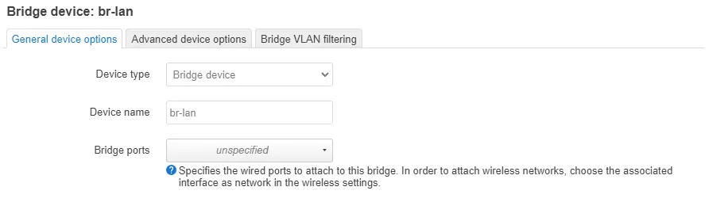
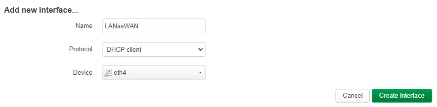
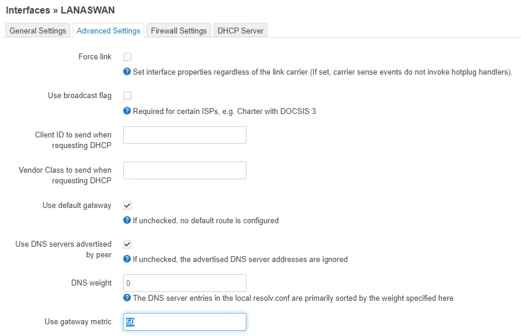
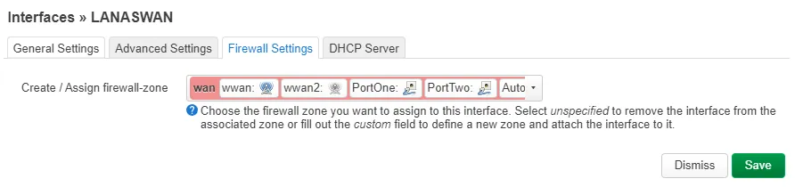

## Change a LAN port to WAN

Example using the Flint, changing `LAN` to be used as WAN:

{: style="max-height:700px;border:6px solid #d2ccf1;"}

***

1. Visit *Network* -> *Devices*, then click *Edit* next to `br-lan`.
{: style="max-height:700px;border:6px solid #d2ccf1;"}
2. Select `unspecified` in *Bridge ports* field, and note down the previous selection (`eth4` in Flint, `eth2` in Slate, `eth0` others.).
3. *Save and Apply* then head to *Interfaces* sub-tab.
4. Click *Add new interface...*,choose a name and the previously noted device, then set metric to a number higher than `10`, and firewall to zone *RED*.
{: style="max-height:700px;border:6px solid #d2ccf1;"}
{: style="max-height:700px;border:6px solid #d2ccf1;"}
{: style="max-height:700px;border:6px solid #d2ccf1;"}
5. All done! Wi-Fi interruption may occur.