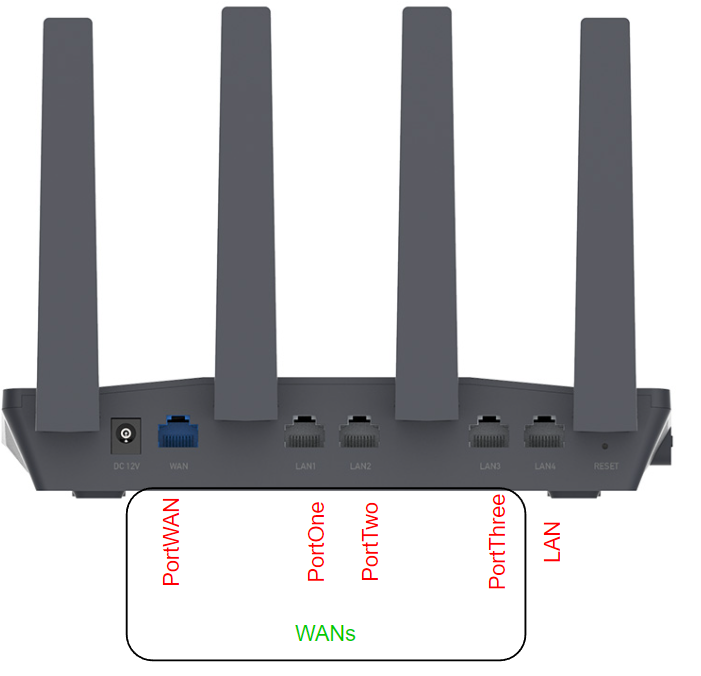
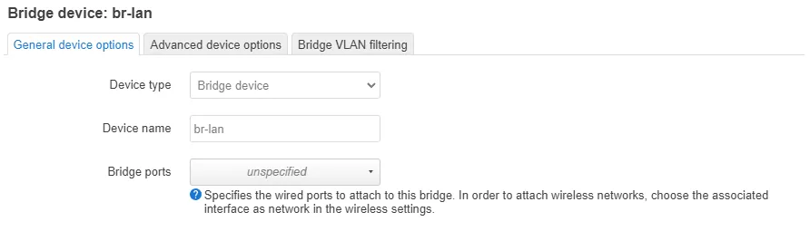
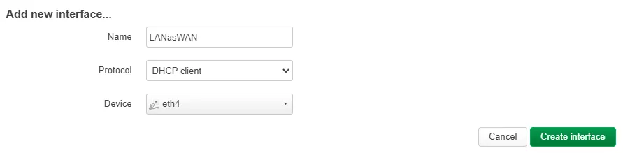
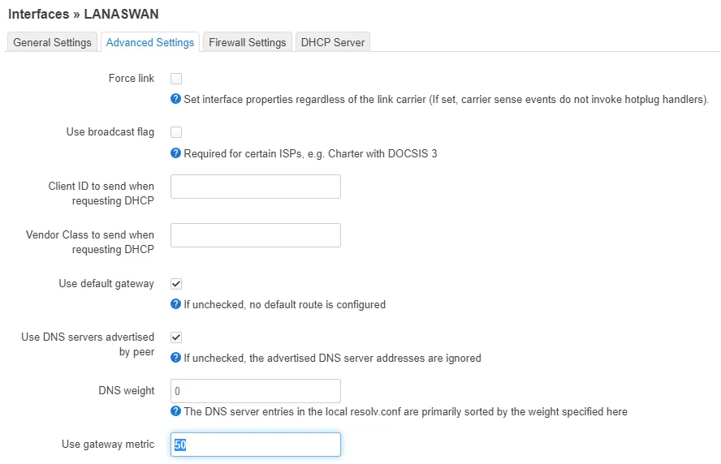
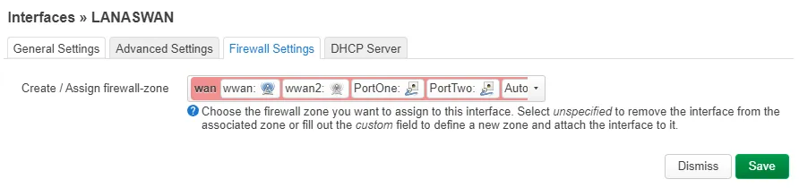

# Change a LAN Port to WAN

Example using the Flint, changing `LAN` to be used as WAN

{: style="max-height:700px; border:6px solid #d2ccf1;"}

---

### Modify the LAN Bridge
1. Navigate to **Network** -> **Devices**, then click **Edit** next to `br-lan`.
   {: style="max-height:700px; border:6px solid #d2ccf1;"}
2. In the **Bridge ports** field, select `unspecified`. Note down the previous selection (e.g., `eth4` for Flint, `eth2` for Slate, or `eth0` for other devices).
3. Click **Save and Apply**.

---

### Add a New Interface
1. Go to the **Interfaces** sub-tab.
2. Click **Add new interface...**.
3. Choose a name for the new interface and select the previously noted device.
4. Set the **Metric** to a value higher than `10`.
5. Assign the firewall zone to **RED**.
   {: style="max-height:700px; border:6px solid #d2ccf1;"}
   {: style="max-height:700px; border:6px solid #d2ccf1;"}
   {: style="max-height:700px; border:6px solid #d2ccf1;"}

---

Note that a brief Wi-Fi interruption may occur during the process.